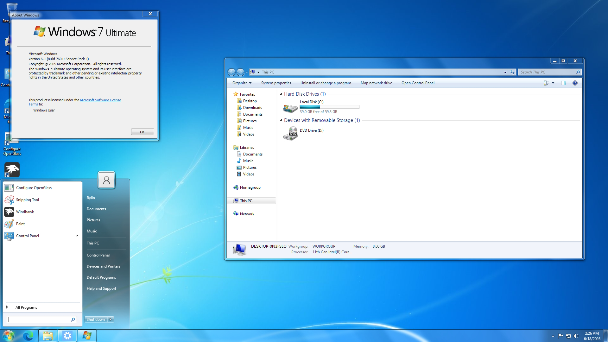

# BryteBox-Configs
Here you will find everything that I use for my Windows install that make my daily use more interesting and/or helpful.
 

 
# Windhawk Mods
DWM 3D Transformations (Windows 7 Open and Close animations) (Mod is in Releases) 
Dark Mode for Notepad 
Fix Darkmode ListViews 
Logon, Logoff & Shutdown Sounds Restored. 
Modernize Folder Picker Dialog 
Hide NVIDIA Control Panel Missing Dialog 
Logon & Sleep Fade Restorer 
Win32 Tray Clock Experience 
Resource Redirect (with Windows 11 New (default) theme)
# Registry Tweaks
Remove Scan with Microsoft Defender from Context Menu 
Remove Drives from Navigation Pane 
Windows 8 Volume Mixer 
Windows 8 Network Screen 
# Programs
<a href="https://github.com/aubymori/OpenWithEx" target=_blank>OpenWithEX</a> 
<a href="https://gadgetpack.net/" target="_blank">GadgetPack</a> 
<a href="https://github.com/voidtools/voidImageViewer" target="_blank">Void Image Viewer</a> 
# Other things
Windows 8 Sounds 
<a href="https://www.michieldb.nl/other/cursors/">Posy's Dark Cursor</a>
