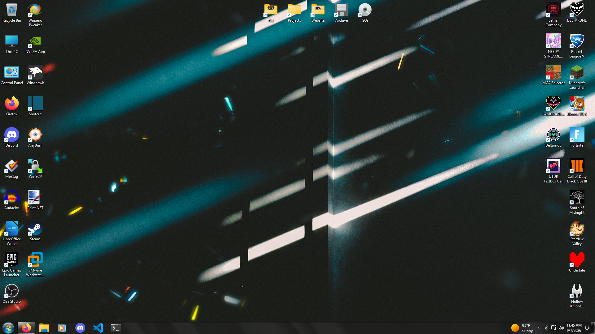
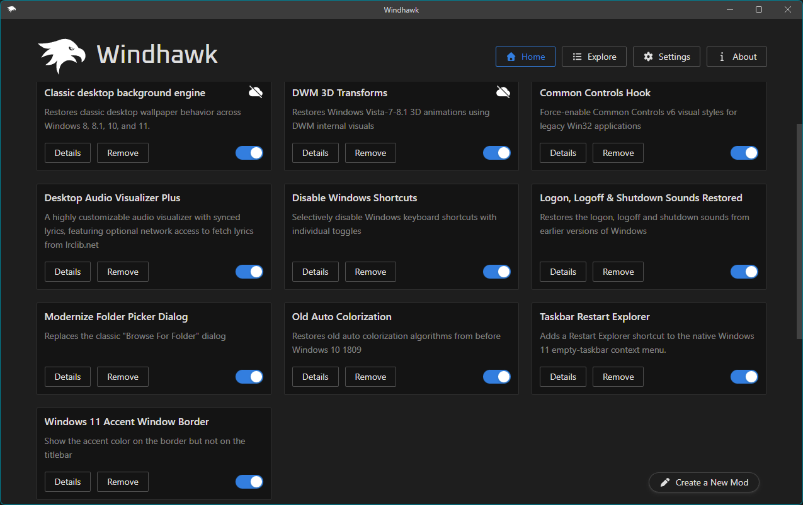
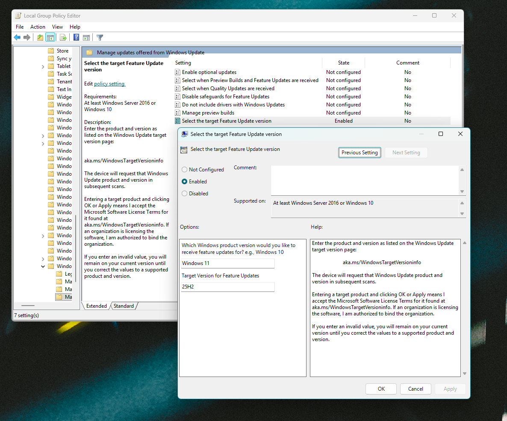
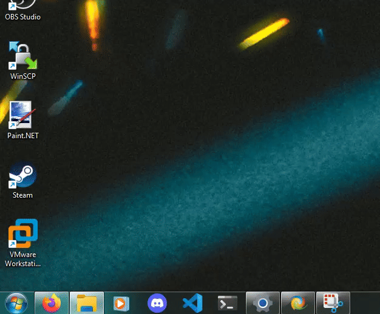

# BryteBox-Configs
Here you will find everything that I use for my Windows install that make my daily use more interesting and/or helpful.
 

 
# Windhawk Mods

<li>Classic desktop background engine (The wallpaper appears even if Explorer is not running) (Mod in Windhawk Folder)</li>
<li>DWM 3D Transformations (Windows 7 Open and Close animations) (Mod in Windhawk Folder)</li>
<li>Common Controls Hook (Makes legacy dialogs use modern visual styles)</li>
<li>Desktop Audio Visualizer Plus (Used to make a Dancing Taskbar hehe. Check out the gif on the bottom of the README)</li>
<li>Disable Windows Shortcuts (I disable Win+S which is the Search, it breaks my immersion for the Windows 7 Taskbar and its nice to just not hit it on accident)</li>
<li>Logon & Sleep Fade Restorer</li>
<li>Logon, Logoff & Shutdown Sounds Restored</li>
<li>Modernize Folder Picker Dialog</li>
<li>Old Auto Colorization (Windows Auto Color Picker worked differently between 11, 10, an 8. It gradually became duller and darker at least with what I noticed. I use the Windows 8 option so that way if I choose a new wallpaper the Accent Window Border and Taskbar have brighter colors.)</li>
<li>Taskbar Restart Explorer</li>
<li>Windows 11 Accent Window Border (Adds the accent color to the sides of the window without having to enable colored titlebars in the settings)</li>
# Registry Tweaks
<li>Add Reg Owner and Reg Org to Winver (You'll have to edit the file in notepad to get it what you want it to say)</li>
<li>Add DWORD value for Logon & Sleep Fade Restorer WH mod</li>
<li>Restore Logon, Logoff, and Shutdown sound options to CPL</li>
<li>Remove Scan with Microsoft Defender from Context Menu</li>
# Programs
<li><a href="https://github.com/voidtools/voidImageViewer" target="_blank">Void Image Viewer</a></li>
<li><a href="https://www.startallback.com/" target="_blank">StartAllBack</a> (I use Windows 7 configs)</li>
# Group Policy Editor
I only have 1 thing changed and its "Select the target Feature Update Version", basically what this does is it prevents from upgrading to the next big release update that Microsoft pushes every year, I have 25H2, so entering 25H2 into the field will NOT give me the 26H2 update when it releases. I do this because upgrading major versions gives me issues with my system configs and programs, I don't wanna have to edit them all over again. But if you were wanting to go the next version of Windows after some time has past, then you can just set the setting to Not Configured which is its default state. To find this, go to Administrative Templates > Windows Components > Windows Update > Manage updates offered from Windows Update.

# Other things
I do have a lot of other tweaks involving background tasks and general "privacy" bullshit that I only really use for performance, I'd say if you're looking for stuff like that check out the Chris Titus Windows Utility cause it is the easiest to figure out along with a lot of information + toggles.

